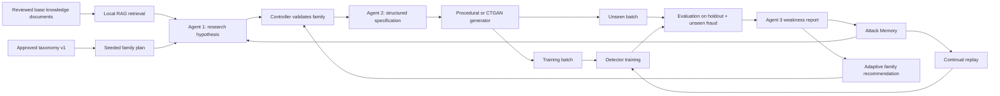

# AI Defence Lab
## Current Pipeline, Metrics, and Iteration Guide

**Document version:** 1.0  
**Status:** Current implementation guide  
**Data policy:** Synthetic-only, offline evaluation

## 1. Executive Summary

The project is an offline red-team/blue-team research loop for synthetic payment-security data. It combines reviewed knowledge summaries, an Attack Memory, Qwen agents, a conditional tabular generator, and a fraud detector.

The current strongest experiment is:

```text
QwenAgents
    +
Conditional CTGAN
    +
Adaptive family selection
    +
Continual detector with hard-example replay
    +
3 seeds x 5 rounds
```

The system does not use real cardholder data, production payment data, PII, live payment systems, or third-party targets.

## 2. End-to-End Flow



In simple terms:

1. The documents provide general payment-security knowledge.
2. The taxonomy defines which broad attack families can be tested.
3. A seed gives a reproducible starting order.
4. Agent 1 researches a family-specific scenario.
5. Agent 2 converts the scenario into structured constraints.
6. The generator creates synthetic transactions.
7. One attack batch can train the detector; a separate unseen batch tests it.
8. Fidelity and diversity are measured independently from detection.
9. Agent 3 explains the detector weakness.
10. The weakness is written to Attack Memory.
11. Agent 1 uses the weakness to recommend the next family.
12. In continual mode, missed attacks are replayed in the next detector training step.

## 3. Explanation of Each Block

### 3.1 Base knowledge documents

The local knowledge base contains reviewed defensive summaries and project-authored methodology notes. Retrieval currently uses term overlap: the query terms are matched against document text, and the highest-scoring excerpts are returned.

The documents are context for Agent 1. They do not directly determine the final family plan.

They answer:

```text
What kinds of payment-security behavior are known or worth investigating?
```

### 3.2 Approved taxonomy

The current taxonomy is `taxonomy_v1` and contains:

```text
account_takeover
trusted_device
beneficiary_manipulation
low_and_slow
social_engineering
merchant_abuse
cross_channel_anomaly
```

The taxonomy is a controlled benchmark vocabulary. It is not a claim that all possible attacks are known.

A family is included when it:

- represents a meaningfully different behavior,
- maps to fields in the current synthetic schema,
- can be generated safely,
- can be evaluated by the detector,
- can be explained and compared across seeds.

New combinations should first be candidates or variants. They should be promoted only after schema, realism, generator, novelty, and repeated-seed checks.

### 3.3 Seeded initial plan

`build_round_family_plan(rounds, seed)` shuffles the approved families using a deterministic random generator. For example, a seed may start with:

```text
account_takeover
social_engineering
trusted_device
beneficiary_manipulation
cross_channel_anomaly
```

The seed makes the starting order repeatable. It does not permanently control every later round in the adaptive implementation.

### 3.4 Agent 1: Attack Researcher

Agent 1 receives:

- retrieved knowledge excerpts,
- recent Attack Memory,
- the current query,
- the allowed family candidates.

It produces an `AttackHypothesis` containing:

- attack ID,
- attack family,
- scenario,
- target context,
- behavioral mechanism,
- novelty rationale,
- research direction.

It does not generate raw transaction rows.

After the first round, Agent 1 also produces a structured `FamilyRecommendation` containing:

- recommended family,
- recommendation type,
- reason,
- target weakness,
- confidence.

The controller validates the recommendation against the approved taxonomy and recent history.

### 3.5 Controller validation

The controller is the final authority for family selection. It prevents the model from introducing an invalid or unsupported category.

The current policy is:

```text
Round 1:
    use the seeded plan

Later rounds:
    ask Agent 1 for a recommendation
    accept it only if it is an unused approved family
    otherwise use the seeded fallback family
```

The recommendation source is recorded as either:

```text
seeded_plan
agent_1_adaptive_recommendation
```

This makes the adaptive decision auditable.

### 3.6 Agent 2: Attack Specification Strategist

Agent 2 receives Agent 1's hypothesis, not the detector's result directly. It writes a structured simulation recipe:

- temporal pattern,
- amount pattern,
- device pattern,
- beneficiary pattern,
- feature constraints,
- realism constraints,
- evasion objective.

The code normalizes dictionary or list outputs from Qwen into strings where the contract requires strings, then validates the result with Pydantic.

This block turns an idea into a reproducible data-generation instruction.

### 3.7 Generator

There are two generator paths:

**Procedural family generator**

A deterministic generator samples synthetic rows from family-specific profiles. It is the original baseline.

**Conditional CTGAN**

CTGAN is trained on a permitted synthetic corpus containing legitimate rows and generated rows for the approved families. It samples conditionally by `attack_family`. The wrapper filters the output and refuses to relabel mixed-family rows.

The generator is responsible for rows. The LLM is responsible for research direction and constraints.

### 3.8 Data splits

For each run:

- `reference`: legitimate synthetic transactions used as the source population.
- `train_reference`: 80% sample of the reference data.
- `fidelity_reference`: the disjoint remaining 20% reference data.
- `holdout`: separately generated legitimate synthetic transactions using `seed + 1`.
- `train_attacks`: generated attack rows used partly for detector training.
- `unseen_attacks`: separately seeded attack rows used for fidelity and detector evaluation.

The detector training attack count is:

$$
N_{train\_attack} = \lfloor N_{attack} \times f_{train} \rfloor
$$

With the full experiment configuration:

```text
N_attack = 80
f_train = 0.60
N_train_attack = 48
N_unseen_attack = 80
N_train_reference = 320
N_holdout = 100
```

The unseen attack rows are not used to fit the detector.

### 3.9 Fidelity evaluator

The fidelity evaluator compares unseen generated attacks with the disjoint legitimate synthetic reference subset. It measures whether the generated batch is plausible relative to the project's synthetic normal-behavior ruler.

It is not a comparison with real Mastercard traffic.

### 3.10 Diversity evaluator

The diversity evaluator checks whether generated rows are varied and whether the batch covers the available channels and family labels.

### 3.11 Blue-team detector

The current detector is a scikit-learn pipeline:

```text
OneHotEncoder(channel)
    +
HistGradientBoostingClassifier
```

It receives legitimate reference rows and detector-training attack rows. It evaluates the combined legitimate holdout and unseen attack set.

The continual mode additionally replays missed attack rows from earlier rounds.

### 3.12 Agent 3: Security Analyst

Agent 3 receives detector and fidelity evidence. It produces a `WeaknessReport` with:

- observed weaknesses,
- supporting evidence,
- priority,
- recommended next direction,
- confidence.

The report is stored in Attack Memory and becomes input to later Agent 1 decisions.

### 3.13 Attack Memory

SQLite stores:

```text
hypothesis
specification
evaluation
weakness
```

Memory is the bridge between rounds. It allows the system to retain what the detector missed and what the analyst recommended.

## 4. Tracked Metrics and Formulas

### 4.1 Confusion matrix

For binary fraud classification:

```text
                 Predicted legitimate   Predicted fraud
Actual legitimate        TN                   FP
Actual fraud             FN                   TP
```

The implementation stores this as:

```text
[[TN, FP], [FN, TP]]
```

### 4.2 Precision

Precision answers:

> When the detector flags a transaction, how often is it actually fraud?

$$
Precision = \frac{TP}{TP + FP}
$$

High precision means fewer false alarms among flagged transactions.

### 4.3 Recall

Recall answers:

> Of all fraudulent transactions, how many did the detector catch?

$$
Recall = \frac{TP}{TP + FN}
$$

Recall is the main weakness observed in the project. A detector can have high precision while still missing many attacks.

### 4.4 F1 score

F1 balances precision and recall using the harmonic mean:

$$
F1 = 2 \times \frac{Precision \times Recall}{Precision + Recall}
$$

The implementation uses `zero_division=0` when a denominator is zero.

### 4.5 ROC-AUC

ROC-AUC measures ranking quality across classification thresholds. It is the area under the curve of:

$$
TPR = Recall = \frac{TP}{TP + FN}
$$

and

$$
FPR = \frac{FP}{FP + TN}
$$

A value near `1.0` means fraudulent rows tend to receive higher fraud probabilities than legitimate rows. A value near `0.5` is close to random ranking.

The overall ROC-AUC is computed from detector probabilities. The current family-level ROC-AUC output has a caveat: family subsets contain fraud rows only, so there is no negative class within an individual family. The implementation therefore falls back to `0.5` for that family-level value. Family-level recall, precision, F1, and support are more meaningful in the current report.

### 4.6 False-positive rate

The implementation calculates:

$$
FPR = \frac{FP}{N_{legitimate\ evaluation\ rows}}
$$

where the denominator is the number of legitimate rows in the evaluation set.

This tells us how often normal synthetic transactions are incorrectly flagged.

### 4.7 Support

For a family:

$$
Support_{family} = N_{fraud\ rows\ in\ that\ family}
$$

Support is a count, not a quality score. A metric calculated on a tiny support is less stable.

### 4.8 Amount mean delta

The evaluator calculates:

$$
AmountMeanDelta = |\mu_{reference} - \mu_{attack}|
$$

where $\mu$ is the mean transaction amount.

Lower is closer to the reference distribution, but a family-specific attack may intentionally differ from normal amounts. This metric must therefore be interpreted alongside the attack specification.

### 4.9 Amount standard-deviation delta

$$
AmountStdDelta = |\sigma_{reference} - \sigma_{attack}|
$$

It measures the difference in amount variability.

### 4.10 Behavioral signal delta

The implementation compares the means of:

```text
device_change
beneficiary_change
velocity_24h
```

It calculates:

$$
BehaviorDelta = \frac{1}{3} \sum_{j=1}^{3} |\bar{x}_{reference,j} - \bar{x}_{attack,j}|
$$

A lower value means the attack batch is closer to the synthetic legitimate reference on these signals. A higher value may be expected for a clearly differentiated family, so this is not a universal “lower is always better” score.

### 4.11 Channel coverage

There are three allowed channels:

```text
web, mobile, card_present
```

The formula is:

$$
ChannelCoverage = \frac{\text{number of distinct channels in attack batch}}{3}
$$

A value of `1.0` means all three channels appear.

### 4.12 Behavioral plausibility

The current internal plausibility score is:

$$
P = max\left(0, 1 - min\left(1, 0.25A + 0.25S + 0.25B + 0.25C\right)\right)
$$

where:

$$
A = \frac{AmountMeanDelta}{max(\mu_{reference}, 1)}
$$

$$
S = \frac{AmountStdDelta}{max(\sigma_{reference}, 1)}
$$

$$
B = BehaviorDelta
$$

$$
C = 1 - ChannelCoverage
$$

The score is bounded between `0.0` and `1.0`.

The current pass flag is:

$$
Passed = (P \ge 0.35)
$$

This is an internal heuristic. It is not a hackathon scoring formula and not evidence of live-payment realism.

### 4.13 Unique-row ratio

$$
UniqueRowRatio = \frac{N_{unique\ rows}}{N_{all\ rows}}
$$

A value of `1.0` means no duplicate rows were found in the batch.

### 4.14 Numeric feature variation

The evaluator counts unique values for:

```text
amount, hour, device_change, beneficiary_change, velocity_24h
```

It reports the mean number of unique values across these columns:

$$
NumericVariation = \frac{1}{5} \sum_{j=1}^{5} UniqueValues(feature_j)
$$

This is a basic diversity indicator, not a distribution-quality test.

### 4.15 Family coverage ratio

The current per-batch attack generator normally creates one family per batch. The formula is:

$$
FamilyCoverageRatio = \frac{max(N_{distinct\ families}, 1)}{7}
$$

The denominator is the seven approved families. For a one-family batch, this is approximately $1/7$. It should not be interpreted as saying one family is a failed batch; family diversity is controlled at the round/suite level.

### 4.16 Channel entropy

Let $p_i$ be the fraction of generated rows in channel $i$. Shannon entropy is:

$$
H = -\sum_i p_i \log_2(p_i)
$$

The implementation normalizes it by the maximum entropy for three channels:

$$
NormalizedChannelEntropy = \frac{H}{\log_2(3)}
$$

A value near `1.0` means the channel mix is balanced. A value near `0.0` means one channel dominates.

### 4.17 Novelty score

Novelty is an internal token-level heuristic. The current hypothesis is converted into a token set and compared with each prior memory item.

For current terms $T$ and prior terms $P_i$:

$$
Similarity_i = \frac{|T \cap P_i|}{max(|T \cup P_i|, 1)}
$$

The maximum prior similarity is:

$$
MaxSimilarity = max_i(Similarity_i)
$$

The novelty score is:

$$
NoveltyScore = 1 - MaxSimilarity
$$

It is not semantic novelty in the scientific sense and is not an official hackathon metric.

### 4.18 Hard-example replay count

In continual mode, after evaluation the detector predicts unseen attack rows. Rows predicted as legitimate are considered missed hard examples:

$$
MissedRows_t = \{x \in UnseenAttacks_t : Prediction(x) = 0\}
$$

The replay buffer is updated as:

$$
ReplayBuffer_t = Unique(ReplayBuffer_{t-1} \cup MissedRows_t)
$$

The stored count is:

$$
ReplayCount_t = |ReplayBuffer_t|
$$

Implementation note: the current field is recorded after adding the current round's missed examples. Therefore, the round 1 value is the buffer available after round 1, not strictly the number replayed into round 1. For a future cleaner report, separate fields should be used: `hard_examples_added` and `hard_examples_used_for_training`.

## 5. Which Metrics Are Hackathon Requirements?

The supplied rules require a code repository, a solution walkthrough, and a working web prototype. They allow synthetic, anonymized, or authorized sample data and prohibit real cardholder, PII, production payment, live-system, payment-infrastructure, and third-party targeting.

The rules do not prescribe the project's internal formulas for:

```text
F1
recall
precision
ROC-AUC
behavioural plausibility
novelty
channel entropy
unique-row ratio
hard-example replay count
```

### Explicit competition deliverables

These are the requirements we should demonstrate:

- code repository,
- solution walkthrough,
- working web prototype,
- compliance with data and targeting restrictions.

### Internal engineering evidence

These metrics support the technical story but are not official hackathon scoring formulas:

- precision,
- recall,
- F1,
- ROC-AUC,
- false-positive rate,
- fidelity metrics,
- diversity metrics,
- novelty score,
- adaptive decision trace,
- replay-buffer growth,
- seed variance.

The correct wording is:

> These metrics are internal evaluation indicators used to demonstrate method behavior. They are not official Mastercard competition scores.

## 6. Experiment Iterations

### Iteration 1: procedural baseline

Configuration:

```text
HeuristicAgents
+ procedural family-conditional generator
+ current detector
+ 3 seeds x 5 rounds
```

Purpose:

- validate the orchestration,
- validate data splits,
- validate SQLite memory,
- validate family metrics,
- establish a reproducible baseline.

Observed aggregate baseline:

```text
F1:                       0.7698
Recall:                   0.6758
Precision:                0.9163
ROC-AUC:                  0.9418
Novelty:                  0.9462
Behavioural plausibility: 0.4456
```

This was a local engineering baseline and used heuristic agents.

### Iteration 2: learned generator

Configuration:

```text
QwenAgents
+ conditional CTGAN
+ current detector
+ 3 seeds x 5 rounds
```

Purpose:

- test whether a learned tabular generator improves plausibility and challenge quality,
- hold the detector and evaluation protocol constant,
- retain strict family purity.

Observed aggregate result:

```text
F1:                       0.8125
Recall:                   0.7100
Precision:                0.9522
ROC-AUC:                  0.9321
Novelty:                  0.9558
Behavioural plausibility: 0.5587
```

Compared with the procedural baseline, CTGAN improved internal plausibility and detection F1 in that run. This is a generator comparison, not yet an adaptive or continual detector comparison.

### Iteration 3: adaptive red team

Configuration:

```text
QwenAgents
+ conditional CTGAN
+ Agent 1 adaptive family recommendations
+ static detector
+ 3 seeds x 5 rounds
```

Round 1 uses the seeded plan. Later rounds use Agent 1 recommendations based on the previous weakness and recent memory, subject to controller validation.

Observed aggregate result:

```text
F1:                       0.8010
Recall:                   0.6842
Precision:                0.9685
ROC-AUC:                  0.9248
Novelty:                  0.9569
Behavioural plausibility: 0.5126
```

This iteration demonstrates adaptive challenge selection. It does not prove that the blue team itself learns over time.

### Iteration 4: continual blue team

Configuration:

```text
QwenAgents
+ conditional CTGAN
+ adaptive family recommendations
+ continual detector with hard-example replay
+ 3 seeds x 5 rounds
```

Reference 3 is the only comparison reference:

```text
Adaptive QwenAgents + CTGAN + static detector
```

Continual result:

```text
F1:                       0.8115
Recall:                   0.7600
Precision:                0.8801
ROC-AUC:                  0.9178
Novelty:                  0.9709
Behavioural plausibility: 0.5914
```

Comparison against Reference 3:

| Metric | Reference 3 | Continual | Change |
|---|---:|---:|---:|
| F1 | 0.8010 | 0.8115 | +0.0105 |
| Recall | 0.6842 | 0.7600 | +0.0758 |
| Precision | 0.9685 | 0.8801 | -0.0884 |
| ROC-AUC | 0.9248 | 0.9178 | -0.0070 |
| Novelty | 0.9569 | 0.9709 | +0.0140 |
| Plausibility | 0.5126 | 0.5914 | +0.0788 |

Interpretation:

- Continual replay caught more attacks overall, shown by the recall increase.
- F1 improved slightly because the recall gain outweighed part of the precision loss.
- Precision decreased, so the detector became more aggressive and may create more false alerts.
- The generator remained novel and internally plausible.
- This is a measured recall-oriented improvement, not a universal improvement across every metric.

## 7. How to Explain Convergence

The project should not claim that convergence means the detector reaches F1 of `1.0` or that attacks become easy. A better definition is a stable challenge-response equilibrium:

```text
Red-team plausibility remains acceptable.
Red-team novelty and diversity remain healthy.
Blue-team recall and F1 improve or stabilize.
False-positive rate remains monitored.
Residual weaknesses become narrower and more actionable.
```

The current evidence supports:

```text
adaptive family selection works
continual replay works
recall improved against the evaluated synthetic stream
```

It does not yet prove perfect convergence because:

- CTGAN and Qwen are stochastic,
- the comparison regenerates attack rows rather than reusing identical rows,
- different adaptive family sequences can make round-to-round metrics non-comparable,
- the detector's threshold remains fixed at `0.5`,
- continual replay currently adds missed rows but does not yet tune calibration.

## 8. Next Technical Improvement

The next improvement should be detector threshold calibration, while keeping the adaptive Qwen + CTGAN red team fixed.

The current continual detector improves recall but loses precision. A calibration experiment should:

1. collect validation probabilities,
2. test thresholds around `0.5`,
3. select a threshold using a declared objective,
4. evaluate once on untouched unseen data,
5. compare recall, precision, F1, ROC-AUC, and false-positive rate.

A possible objective is an internal weighted score:

$$
Utility = \alpha \cdot Recall + \beta \cdot Precision - \gamma \cdot FPR
$$

The weights must be declared before evaluation. This is an internal decision policy, not a Mastercard rule.

The next report should remain separate:

```text
Mastercard_AI_Defence_Lab_Detector_Calibration_v1_20260824.pdf
```

UI work remains the final stage, after the experimental evidence is frozen.

## 9. Safe Submission Language

Use this wording:

> AI Defence Lab is an offline, synthetic-only red-team/blue-team research prototype. Reviewed knowledge and Attack Memory guide Qwen-based research recommendations. A controlled taxonomy provides reproducible benchmark coverage, while detector weaknesses adapt later attack-family selection. Conditional CTGAN generates family-conditioned synthetic transaction rows, and schema, fidelity, diversity, and family-purity checks constrain the output. The blue-team detector is evaluated on unseen synthetic attacks and legitimate holdout data. Continual hard-example replay increased mean recall from 0.6842 to 0.7600 and mean F1 from 0.8010 to 0.8115 relative to Reference 3, with a precision trade-off. All realism and detection metrics are internal synthetic-experiment indicators, not official Mastercard scores or claims about live-payment behavior.

## 10. Final One-Page Mental Model

```text
Documents = general knowledge
Taxonomy = controlled test vocabulary
Seed = reproducible starting order
Agent 1 = research and next-family recommendation
Controller = validation and safety gate
Agent 2 = structured constraints
Generator = synthetic transaction rows
Fidelity = similarity to synthetic normal reference
Diversity = variation and coverage
Detector = fraud predictions on unseen rows
Agent 3 = weakness analysis
Memory = bridge to the next round
Continual replay = train on previously missed attacks
Graphs = evidence of red-team quality and blue-team response
Reports = versioned record of each improvement
```
